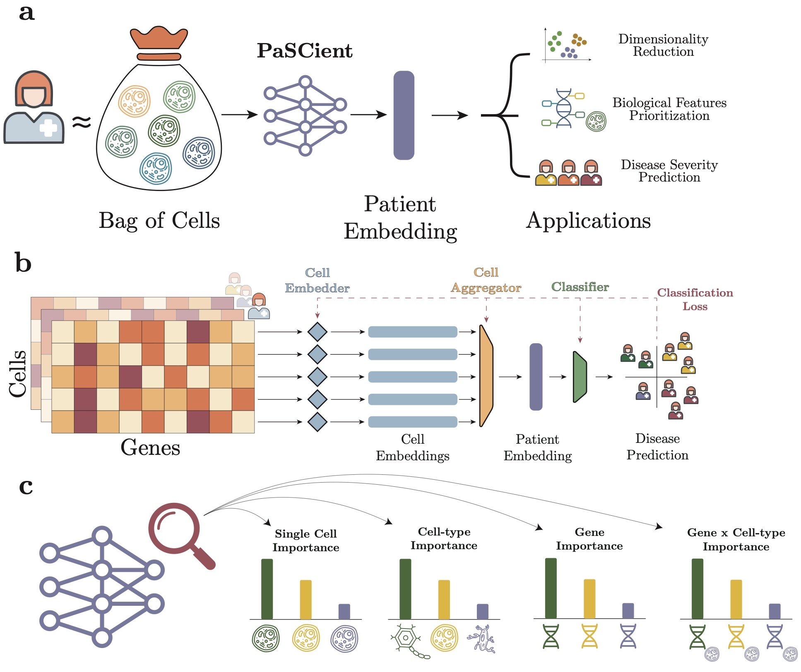

# PaSCient: Learning multi-cellular representations of single-cell transcriptomics data enables characterization of patient-level disease states



## Setup environment

```
conda create -n pascient python=3.11
```

## Install
```
pip install -r requirements.txt
```

## Train a PaSCient model


`cd /pascient/scripts/`

```
HYDRA_FULL_ERROR=1 python train.py data.persistent_workers=True data.multiprocessing_context=null data.num_workers=12 experiment=pascient_multilabel paths.tiledb_dir=YOUR_PATH_TO_YOUR_TILEDB
```

You will need to provide the path to your tiledb.

## PaSCient inference

We provide a notebook with examples on how to run PaSCient on your data in `pascient/notebooks/paper_figures/model_inference_example.ipynb`

## Request model weights

Model weights are available upon request to `debroue1@gene.com`


## Figures reproduction

Figures were generated using the notebooks in  `pascient/notebooks/paper_figures/`

- `UMAP.ipynb` reproduces Figure 3 of the paper
- `IG.ipynb` reproduces Figure 4 of the paper
- `severity.ipynb` reproduces Figure 5 of the paper


## Contact

If you have any questions, please contact Tianyu Liu (tianyu.liu@yale.edu) or Edward De Brouwer (debroue1@gene.com).


